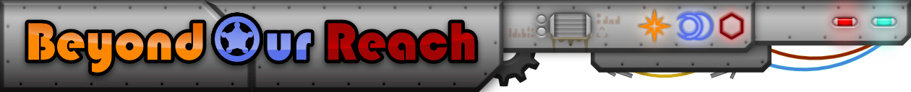

# Join our discord: https://discord.gg/Pgp89VwsKw

    

    
    

## Overview

Welcome to the Beyond Our Reach mod for RimWorld! This mod introduces advanced technologies and research projects to enhance your gameplay experience.

## Features

- **Advanced Research Projects**: Unlock solar, quasaric, tenebrite, and umbra technologies.
- **New Buildings and Items**: Construct new buildings and craft advanced items using unique materials.
- **Enhanced Gameplay**: Improve your colony's efficiency and capabilities with cutting-edge technology.

## Installation

1. Download the mod from the [releases page](https://github.com/databobek/RimworldBeyondOurReach/releases).
2. Extract the contents into your RimWorld `Mods` folder.
3. Enable the mod in the RimWorld mod menu.

## Contributing

We welcome contributions from the community! If you would like to contribute, please follow these steps:

1. Fork the repository.
2. Create a new branch for your feature or bugfix.
3. Make your changes and commit them with clear messages.
4. Submit a pull request to the `main` branch.

## License

This project is licensed under the Creative Commons Attribution-NonCommercial-ShareAlike 4.0 License. See the [LICENSE](LICENSE) file for details.

## Support

If you encounter any issues or have questions, please open an issue on GitHub or join our [Discord server](https://discord.gg/Pgp89VwsKw) for support.

## Acknowledgements

Thank you to all the contributors and the RimWorld community for their support and feedback.

---

    

